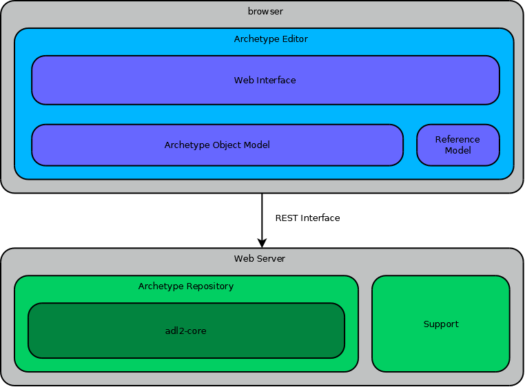

# Adl Designer

ADL 2.0 designer (template designer, archetype editor,...)

## Initial Setup

Prerequisites:

* git client
* Java 1.8 SDK
* Maven 3.0

Clone adl-designer from GitHub:

```bash 
git clone https://github.com/openEHR/adl-designer.git
```    

Go to the newly created directory _adl-designer_. From there, go to _src/main/resources_ and copy configuration 
template files to real configuration:

 ```bash
 cp config.properties-TEMPLATE config.properties
 cp log4j.properties-TEMPLATE log4j.properties
 ```
 
 In config.properties, update:
 
 * archetype.repository.file.location - Path to the directory that contains archetype files. Directory must already exist.
    Any file with .adls extension in this directory and any subfolder will be loaded as an archetype. For a repository with 
    existing archetypes, you can try using a directory with contents of CKM_2013_12_09 Reference archetypes: 
    https://github.com/openEHR/adl-archetypes/tree/master/Reference/CKM_2013_12_09
* template.repository.location -  Path to the directory that contains template files. Directory must already exist.
  
  
 Back at _adl-designer_ directory, use Maven to build the project:  
  
 ```bash
 mvn clean install
 ```
 
This will generate a _designer.war_ file in _designer/target_, which can be deployed into any java web application server.

For development purposes, you may also run the application with the embedded maven tomcat plugin:

```bash
mvn tomcat7:run
```

This will deploy the application on port http://localhost:8080/designer and the endpoint urls will be:
 * http://localhost:8080/designer/archetype-editor.html - Archetype Editor
 * http://localhost:8080/designer/template-editor.html - Template Editor

 
 

## Archetype Editor
Part of the designer module, that is capable editing ADL2 archetypes. Can be accessed on the url _/designer/archetype-editor.html_

**Architecture**



Individual module descriptions:
### Web Interface
The web interface is based on jquery and bootstrap3. Html is generated from templates (templates/\*.hbs) using handlebars. Javascript code resides in _js/archetype-editor/\*_.

### Archetype Object Model
Code for manipulating of Archetype Object Model (AOM). Independent of the web interface. Location: _js/am/\*_. Everything in this module can be accesed though a single global variable: _AOM_.

Some of the supported functionality:

* AOM.ArchetypeModel - Wraps AOM of a single archetype, allowing for easier manipulation. In addition to  functionality such as manipulating terminology, annotations, constraints, translations, bindings, it can also deal with specialized archetypes.
* AOM.NodeId - models a single node id, such as _id1.1.3_.
* AOM.RmPath - models a single rm path, such as _/data[id3]/items[id4]/value_
* AOM.AmQuery - enables searching for cosntraints that match a particular rm path
* AOM.createNewArchetype - Create a new archetype from scratch, with a provided basic structure based on the RM class
* AOM.ReferenceModel - Provides reflection-like functionality for a reference model.

### Reference Model
Contains special handling required for a particular reference model, for example rendering constraint for DV_TEXT. Resides in _js/archetype-editor/module-\*_. Archetype designer currently only supports openEHR reference model, however the code is structured to allow easy addition of new models in the future.

Currently supported reference models:
* module-primitive - support for primitive constraints, such as C_INTEGER and special AOM constrains, such as ARCHETYPE_SLOT.
* module-openehr - support for openEHR reference model

### Archetype Repository
Provides the functionality of an archetype repository, such as listing existing archetypes, load/save archetype. Accessible via REST interface.

### Support
Supporting functionality, such as retrieving supported units.

## Template Editor
Can be accessed on the url _/designer/template-editor.html_.

**Architecture**


Template Editor is built on top of the Archetype Editor. As such, it contains the same functionality (only the Web Interface is mostly rewritten), and has these additions:

### Web Interface
Mostly rewritten for the Template Editor. Javascript code resides in _/js/archetype-editor/template-editor\*_

### Archetype Object Model

* AOM.TemplateModel - Models a single template. Every archetype in the template is included as a specialized ArchetypeModel, so on archetype level it can do everything that Archetype Designer can. Additionaly, it provides functions for adding/removing archetypes from the template.

### Template Repository
Provides functionality of a template repository, such as listing existing templates, load/save template. Accessible via REST interface